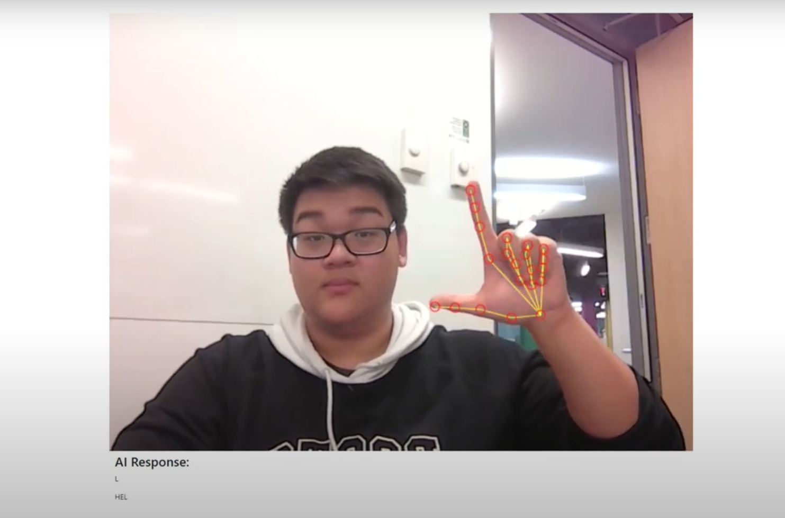
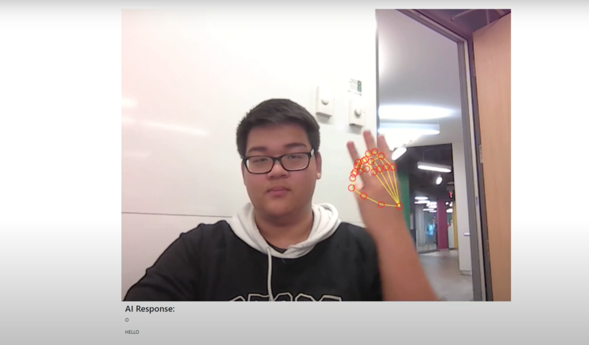

<!-- Intro-->

<!--
* Thanks for reviewing my Project-README-Template! 
* 
* Read the comments for an easy step by step guide. Enjoy!
-->

<!-- Shields Section--> <!-- Optional -->

<!-- 
* Insert project shields and badges through this link https://shields.io/
* 
*
-->

    
    
    

 

<!-- Logo Section  --> <!-- Required -->

<!--
* Insert your github profile URL in the <a> "href" attribute bellow (line-25)
* 
* Insert an image URL in the  "src" attribute bellow. (line-26)
-->

    

<!-- Project title 
* use a dynamic typing-SvG here https://readme-typing-svg.demolab.com/demo/
*
*  Instead you can type your project name after a # header
-->

## About
The idea for AI Sign Language was inspired by the need for accessible and interactive resources for people who want to learn sign language, whether for personal interest, professional development, or to communicate with loved ones who are Deaf or hard of hearing. Traditional learning resources often require in-person instruction or expensive programs, which aren’t feasible for everyone. We wanted to leverage AI and machine learning to make sign language learning more interactive, accessible, and fun for learners.

AI Sign Language provides an interactive platform where users can learn American Sign Language (ASL) through AI-driven video analysis, and real-time feedback. Users can learn simple sign positions and then practice by recording through their webcam. The AI system analyzes the user's gestures, compares them with correct signing techniques, and improve accuracy.

## How to use this project<!-- Required -->
<!-- 
* Here you may add information about how 
* 
* and why to use this project.
-->
- Clone the main and backend branch
- Install node modules and enter npm start to run the website
- Run keypoint_classifier.ipynb and once finished, run Main.py

## Demo<!-- Required -->
<!-- 
* You can add a demo here GH supports images/ GIFs/videos 
* 
* It's recommended to use GIFs as they are more dynamic
-->

## Table of Contents<!-- Optional -->
<!-- 
* This section is optional, yet having a contents table 
* helps keeping your README readable and more professional.
* 
* If you are not familiar with HTML, no worries we all been there :D 
* Review learning resources to create anchor links. 
-->

<dev align="center">
<table align="center">
        <tr>
            <td><a href="#about">About</a></td>        
            <td><a href="#how-to-use-this-project">Getting started</td>
            <td><a href="#demo">Demo</a></td>
            <td><a href="#project-roadmap--">Project Roadmap</a></td>
            <td><a href="#documentation">Documentation</a></td>
        </tr>
        <tr>
            <td><a href="#contributors">Contributors</a></td>
            <td><a href="#acknowledgments">Acknowledgments</a></td>
            <td><a href="#feedback">Feedback</a></td>
            <td><a href="#contact">Contact</a></td>
            <td><a href="#license">License</a></td>
        </tr>
</table>
</dev>

<!-- - Use this html element to create a back to top button. -->

<a href="#how-to-use-this-project">back to top ⬆️</a>

## Contributors<!-- Required -->
<!-- 
* Without contribution we wouldn't have open source. 

* 
* Generate github contributors Image here https://contrib.rocks/preview?repo=angular%2Fangular-ja
-->

- Made with [contrib.rocks](https://contrib.rocks).

## Acknowledgments<!-- Optional -->
<!-- 
* Credit where it's do 
* 
* Feel free to share your inspiration sources, Stackoverflow questions, github repos, tools etc.
-->
I would like to give acknowledgements to <a href="https://www.youtube.com/watch?v=a99p_fAr6e4&list=PL0FM467k5KSyt5o3ro2fyQGt-6zRkHXRv"> Ivan Goncharov </a> on his video on Custom Hand Gesture Recognition with Hand Landmarks Using Google’s Mediapipe + OpenCV in Python. Thanks to <a href="https://github.com/kinivi/hand-gesture-recognition-mediapipe">Nikita Kiselov</a> for translating the github. And thank you to <a href="https://github.com/Kazuhito00/hand-gesture-recognition-using-mediapipe">KazuhitoTakahashi</a> for creating the original repostitory
 
<!-- - Use this html element to create a back to top button. -->

<a href="#how-to-use-this-project">back to top ⬆️</a>

<!-- - Use this html element to create a back to top button. -->

<a href="#how-to-use-this-project">back to top ⬆️</a>

